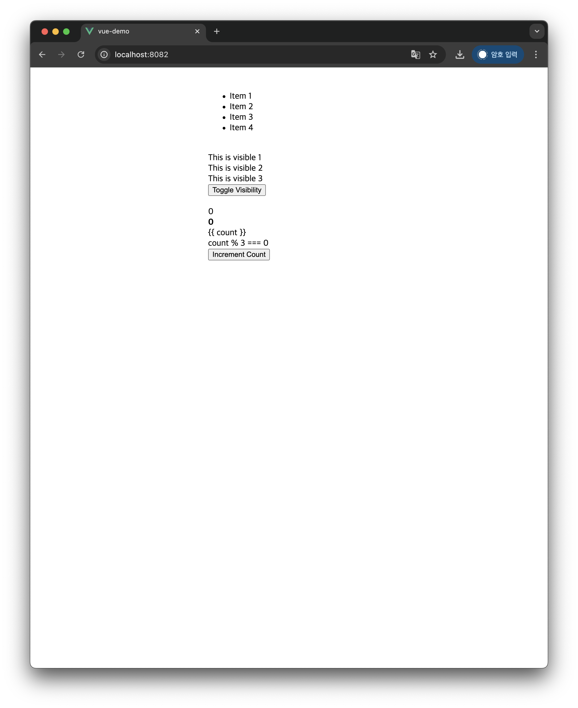
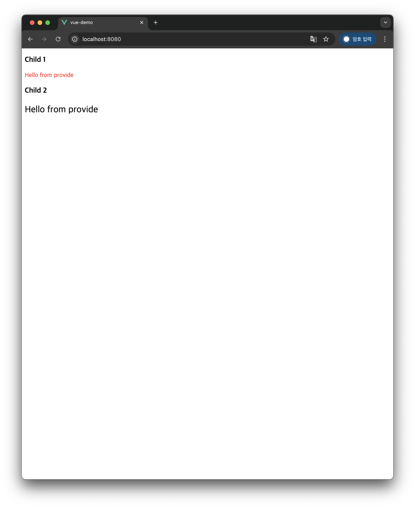
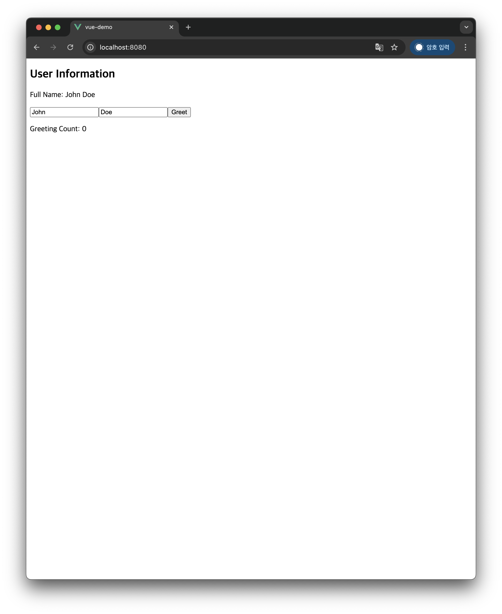

# Vue2 -> Vue 3 전환 변경 요약

---

## 공통 전환 원칙

- **Single File Component**는 가능하면 **`<script setup>`** 사용
- `defineProps`/`defineEmits`는 **컴파일러 매크로** → *import 하지 않음*
- 생명주기 훅은 Composition API 버전 사용:  
  `beforeCreate/created` → (setup 실행 시점 로그) / 필요 시 `onMounted` 등으로 보완  
  `beforeDestroy/destroyed` → `onBeforeUnmount/onUnmounted`
- 반응형 상태: **`ref`**(원시/단일 값), **`reactive`**(객체) 기본
- 템플릿 노출은 `return {}` 불필요(자동 노출)
- 컴포넌트 등록: `<script setup>`에서는 **`import` 후 곧바로 템플릿 사용**

---

## 1) E01Instance
**Before:** Options API (`data()`)  
**After:** `<script setup>` + `ref`

변경 포인트
- `data().message` → `const message = ref('Vue!')`

```vue
<script setup>
import { ref } from 'vue'
const message = ref('Vue!')
</script>
```

---

## 2) E02Reactive
**Before:** Options API (`data`, `computed`, `mounted`)  
**After:** `<script setup>` + `ref`/`computed`/`onMounted`

변경 포인트
- `fullName` → `computed(() => ...)`
- `mounted` → `onMounted`
---

## 3) E03Binding
**Before:** Options API (`data`)  
**After:** `<script setup>` + `ref`

변경 포인트
- `message`를 `ref('Hello Vue')`로 선언
- 템플릿은 동일 (`v-model="message"`)

---

## 4) E04Directives
**Before:** Options API (`data`)  
**After:** `<script setup>` + `ref`/`reactive` (여기서는 배열도 `ref`)

변경 포인트
- `isVisible`, `count`는 `ref`
- `items`는 `ref([...])`
- 모든 디렉티브(v-if, v-show, v-for, v-text, v-html 등) 동작 동일

---
## 5) ChildComponent
**Before:** Options API (`props`, `$emit`)  
**After:** `<script setup>` + `defineProps`/`defineEmits`

변경 포인트
- `props: ['message']` → `defineProps({ message: String })`
- `$emit('custom-event')` → `const emit = defineEmits(['custom-event']); emit('custom-event')`

---

## 6) ParentComponent
**Before:** Options API (`components`, `methods`)  
**After:** `<script setup>` + 직접 import 후 템플릿 사용

변경 포인트
- `components` 옵션 제거, `import ChildComponent`만으로 템플릿에서 사용
- 이벤트 핸들러는 함수로 선언

```vue
<script setup>
import ChildComponent from './ChildComponent.vue'
function handleEvent(payload) { console.log(payload) }
</script>
```
---

## 7) ChildComponent1

**Before:** Options API `inject: ['sharedMessage']` <br>
**After:** `<script setup>` + `defineProps`/`inject`

변경 포인트
- `inject` 매핑 유지
- components 옵션 없이 import만으로 템플릿에서 사용

---
## 8) ChildComponent2
**Before:** Options API `inject: ['sharedMessage']`<br>
**After:** `<script setup>` + `inject`

변경 포인트
- `inject` 매핑 유지
- components 옵션 없이 import만으로 템플릿에서 사용

---

## 9) ParentComponent

**Before:** Options API provide() { `return` { `sharedMessage`: `'...'` } }<br>
**After:** `<script setup>`에서 `provide('sharedMessage', '...')`

변경 포인트
- `<script setup>`에서는 `provide`를 직접 호출
- 자식 컴포넌트는 import만 하면 템플릿에서 바로 사용 가능(등록 불필요)

---

## 10) E07OptionsApi
**Before:** Options API(전체)  
**After:** `<script setup>` + `ref`/`computed`/`watch` + lifecycle

변경 포인트
- `props`는 `defineProps`
- `fullName`는 `computed`
- `watch(greetCount, ...)`로 동일 로직 유지
- `beforeCreate/created`는 `setup` 시점 로그로 대체

---

## 11) E08CompositionApi
**Before:** Options API + `setup()` 조합  
**After:** `<script setup>`

변경 포인트
- `setup()` 내부 로직을 `<script setup>`로 승격
- `return` 제거, 식별자 자동 노출
- `defineProps` 구조분해(또는 `toRef`)로 템플릿 바인딩

---

## 12) E09-CompositionApi2
**Before:** `<script>` + `<script setup>` 혼합, `defineProps`를 import함(오류)  
**After:** **단일 `<script setup>`**, 매크로는 **import 없이** 사용

변경 포인트
- 불필요한 `<script>` 제거
- `const { title } = defineProps({ ... })`로 직접 구조분해

---

## 13) E10-Ref
**Before:** Options API + `setup()`  
**After:** `<script setup>` + `ref`

변경 포인트
- `count`를 `ref(0)`
- `increment()` 동일

---

## 14) E11-Reactive
**Before:** Options API + `setup()` + `reactive`  
**After:** `<script setup>` + `reactive`

변경 포인트
- `person`을 `reactive({ name, age })`로 유지
- 메서드 동일

---

## 15) E12-RefComponent
**Before:** Options API + `setup()` + `ref` + `onMounted`  
**After:** `<script setup>` + `ref` + `onMounted`

변경 포인트
- `<input ref="inputField">` 유지
- `const inputField = ref<HTMLInputElement|null>(null)` (TS 사용 시)
- `inputField.value?.focus()`로 null-safe 접근

---
## 스크린샷
**E01-instance**


**E02-Reactive**


**E03-Binding**


**E04-Directives**


**example3**


**example4**


**E07-OptionsAPI**


**E08-CompositionAPI**


**E09-CompositionAPI2**


**E10-Ref**


**E11-Reactive**


**E12-RefComponent**


---